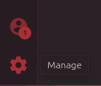
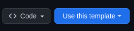
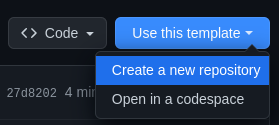
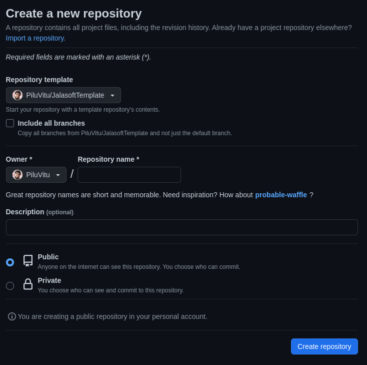
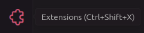
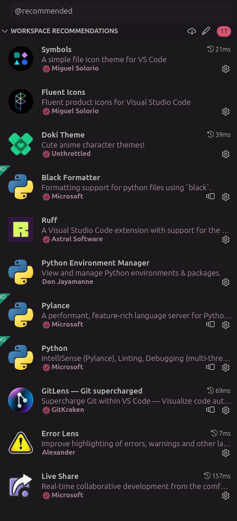
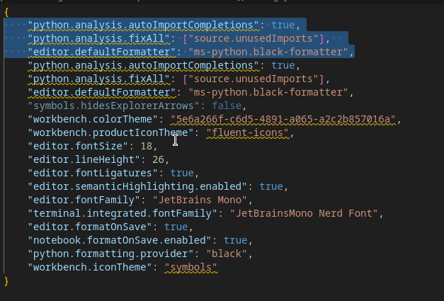
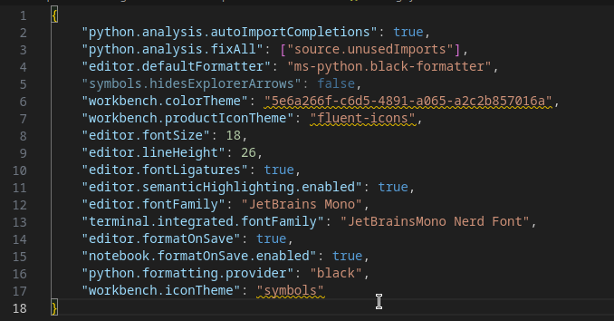

# JalasoftTemplate

## Sumário

- [Configuração Facilitada](#configuração-facilitada)
- [Configuração Adicionais](#configurações-adicionais)
- [Após Configurar Extensões](#após-configurar-extensões)

## Configuração Facilitada

### Clique no icone de configuração (Rodinha dentada)



### Passe o mouse por cima de `Profile` clique em `CreateProfile`

### 

### Click no perfil predefinido em `Python`


### Click em create profile


### Clique na aba de extensões e veja se tem essas extensões instaladas na sua maquinab


### Se tiver as extensões instaladas, parabéns, se desejar vá para o [apos confgurar extensão](#após-configurar-extensões)

## Configurações Adicionais

### Clique no botão azul ao lado de `Code`, escrito `Use this template`



### Clique em criar novo repositório



### Crie um repositório normalmente



### Clone esse novo repositório na sua maquina e abra ele no `VsCode`

### No `VsCode` clique no icone de `Extensions` localizado na aba lateral esquerda do seu `VsCode`



### Na barra de pesquisa da aba das `Extensions` digite `@recommended`, baixe as extensões recomendadas



---

## Após Configurar Extensões

- Após terminar de configurar as extensões base, vamos configurar o melhor cenario para seu `VsCode`
conseguir te alertar de erros no seu código e seu codigo, além de conseguir formatar ele de uma melhor
melhor maneira

### Digite `Ctrl + Shift + P` para abrir o menu de opções do `VsCode` e digite `json`

### Clique na opção que abra o profile settings

### Obs: Caso você não tenha a opções de perfis no vsCode, click na default settings


### Vai abrir esse arquivo desse jeito no seu `VsCode`


### Copie o que está dentro das chaves, e cole no arquivo do seu `VsCode` abaixo do conteúdo que já tem lá

```json
{
    "python.analysis.autoImportCompletions": true,
    "python.analysis.fixAll": ["source.unusedImports"],  
    "editor.defaultFormatter": "ms-python.black-formatter",
    "symbols.hidesExplorerArrows": false,
    "workbench.colorTheme": "5e6a266f-c6d5-4891-a065-a2c2b857016a",
    "workbench.productIconTheme": "fluent-icons",
    "editor.fontSize": 18,
    "editor.lineHeight": 26,
    "editor.fontLigatures": true,
    "editor.semanticHighlighting.enabled": true,
    "editor.fontFamily": "JetBrains Mono",
    "terminal.integrated.fontFamily": "JetBrainsMono Nerd Font",
    "editor.formatOnSave": true,
    "notebook.formatOnSave.enabled": true,
    "python.formatting.provider": "black",
    "workbench.iconTheme": "symbols"
}
```

### Obs: Caso o arquivo apresente alguns erros em amarelo como os a seguir


### Selecione as primeiras opções como o exemplo a seguir e delete



### OBS: Caso fique alguns valores em amarelo, como o exemplo a seguir



### Instale as seguintes extensões


- Elas servem para personalizar o seu `VsCode` e tornar mais facil de ler o seu código
